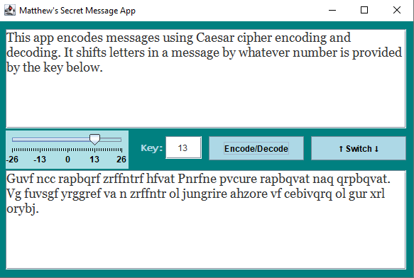
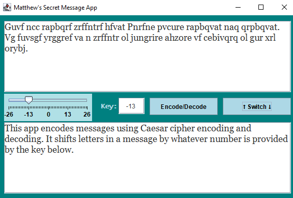

# secretMessages

This program encodes and decodes messages by shifting char values app or down the alphabet. The slider can be used, or a key between -26 and 26 can be entered in.

## Example

## Switch button

